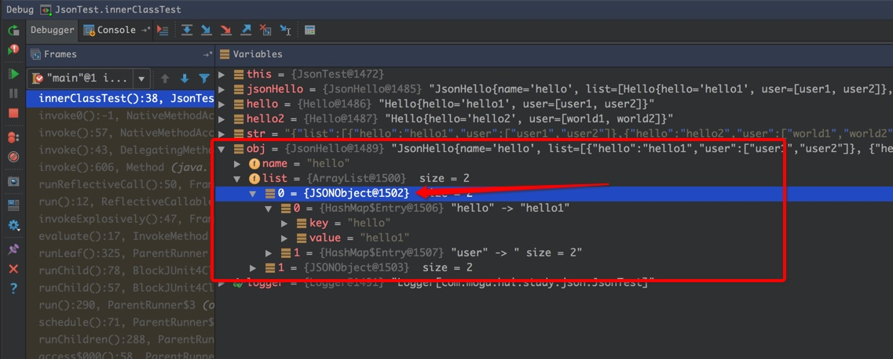
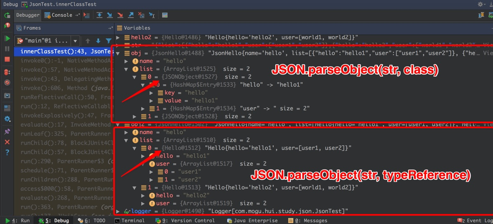

## 问题描述

使用fastJson对json字符串进行反序列化时，有几个点需要注意一下：

- 反序列化内部类
- 反序列化模板类

### 1. 内部类问题

反序列化一个类的内部类时，可能会获取意想不到的结果，实例如下:


```java
// 测试用例
package com.mogu.hui.study.json;

import java.util.List;

/**
 * 用于测试json序列化
 * Created by yihui on 16/4/22.
 */
public class JsonHello {
    private String name;

    private Hello hello;

    public JsonHello () {

    }

    public String getName() {
        return name;
    }

    public void setName(String name) {
        this.name = name;
    }

    public Hello getHello() {
        return hello;
    }

    public void setHello(String hello, List<String> user) {
        Hello h = new Hello();
        h.setHello(hello);
        h.setUser(user);
        this.hello = h;
    }

    @Override
    public String toString() {
        return "JsonHello{" +
                "name='" + name + '\'' +
                ", hello=" + hello +
                '}';
    }

    private class Hello {
        String hello;
        List<String> user;

        public Hello(){

        }

        public String getHello() {
            return hello;
        }

        public void setHello(String hello) {
            this.hello = hello;
        }

        public List<String> getUser() {
            return user;
        }

        public void setUser(List<String> user) {
            this.user = user;
        }

        @Override
        public String toString() {
            return "Hello{" +
                    "hello='" + hello + '\'' +
                    ", user=" + user +
                    '}';
        }
    }


}
```

测试文件容下：

```java
package com.mogu.hui.study.json;

import com.alibaba.fastjson.JSON;
import org.junit.Test;
import org.slf4j.LoggerFactory;
import org.slf4j.Logger;


import java.util.Arrays;

/**
 * Created by yihui on 16/4/22.
 */
public class JsonTest {
    private static Logger logger = LoggerFactory.getLogger(JsonTest.class);


    @Test
    public void innerClassTest() {
        try {
            JsonHello jsonHello = new JsonHello();
            jsonHello.setName("hello");
            jsonHello.setHello("innerHello", Arrays.asList("user1", "user2"));

            String str = JSON.toJSONString(jsonHello);
            logger.info("Str: {}", str);

            Object obj = JSON.parseObject(str, JsonHello.class);
            logger.info("Obj: {}", obj);
        } catch (Exception e) {
            logger.info("error: {}", e);
        }
    }
}
```

输出结果：
```
17:20:08.863 [main] INFO  com.mogu.hui.study.json.JsonTest - Str: {"hello":{"hello":"innerHello","user":["user1","user2"]},"name":"hello"}
17:21:44.425 [main] INFO  com.mogu.hui.study.json.JsonTest - Obj: JsonHello{name='hello', hello=null}
```

从上面的输出可以看出，反序列化对象的时候，出现诡异的事情，JsonHello对象的hello元素变成了 null

那么是如何产生这个问题的呢？

其实也简单，因为内部类，json反序列化的时候，无法得到该类，`"hello":{"hello":"innerHello","user":["user1","user2"]}` 这个串没法愉快的转换为 `Hello` 对象

**这种问题如何避免？**

不要反序列化匿名类，内部类！！！


### 2. 模板类

关于模板类，反序列化的主要问题集中在无法正确的反序列化为我们预期的对象，特别是目标对象内不嵌套有容器的时候，这种问题就更明显了，测试实例如下:

```java
package com.mogu.hui.study.json;

import java.util.List;

/**
 * 用于测试json序列化
 * Created by yihui on 16/4/22.
 */
public class JsonHello<T> {
    private String name;

    private List<T> list;

    public JsonHello () {

    }

    public String getName() {
        return name;
    }

    public void setName(String name) {
        this.name = name;
    }

    public List<T> getList() {
        return list;
    }

    public void setList(List<T> list) {
        this.list = list;
    }

    @Override
    public String toString() {
        return "JsonHello{" +
                "name='" + name + '\'' +
                ", list=" + list +
                '}';
    }
}

class Hello {
    String hello;
    List<String> user;

    public Hello(){

    }

    public String getHello() {
        return hello;
    }

    public void setHello(String hello) {
        this.hello = hello;
    }

    public List<String> getUser() {
        return user;
    }

    public void setUser(List<String> user) {
        this.user = user;
    }

    @Override
    public String toString() {
        return "Hello{" +
                "hello='" + hello + '\'' +
                ", user=" + user +
                '}';
    }
}
```

测试类
```java
package com.mogu.hui.study.json;

import com.alibaba.fastjson.JSON;
import org.junit.Test;
import org.slf4j.Logger;
import org.slf4j.LoggerFactory;

import java.util.Arrays;

/**
 * Created by yihui on 16/4/22.
 */
public class JsonTest {
    private static Logger logger = LoggerFactory.getLogger(JsonTest.class);


    @Test
    public void innerClassTest() {
        try {
            JsonHello<Hello> jsonHello = new JsonHello<>();
            jsonHello.setName("hello");

            Hello hello = new Hello();
            hello.setHello("hello1");
            hello.setUser(Arrays.asList("user1", "user2"));

            Hello hello2 = new Hello();
            hello2.setHello("hello2");
            hello2.setUser(Arrays.asList("world1", "world2"));

            jsonHello.setList(Arrays.asList(hello, hello2));


            String str = JSON.toJSONString(jsonHello);
            logger.info("Str: {}", str);

            Object obj = JSON.parseObject(str, JsonHello.class);
            logger.info("Obj: {}", obj);
        } catch (Exception e) {
            logger.info("error: {}", e);
        }
    }
}
```

聚焦在反序列化的obj对象上，反序列化的结果，debug结果如附图


我们希望转换为 JsonHello<Hello> 的对象格式，而我们获取到的结果呢？ 其内部的list为一个ArrayList对象，list中的元素为 JsonObject




**这种问题改如何解决:**

利用 TypeReference

```
@Test
public void innerClassTest() {
  try {
      JsonHello<Hello> jsonHello = new JsonHello<>();
      jsonHello.setName("hello");

      Hello hello = new Hello();
      hello.setHello("hello1");
      hello.setUser(Arrays.asList("user1", "user2"));

      Hello hello2 = new Hello();
      hello2.setHello("hello2");
      hello2.setUser(Arrays.asList("world1", "world2"));

      jsonHello.setList(Arrays.asList(hello, hello2));


      String str = JSON.toJSONString(jsonHello);
      logger.info("Str: {}", str);

      Object obj = JSON.parseObject(str, JsonHello.class);
      logger.info("Obj: {}", obj);

      Object obj2 = JSON.parseObject(str, new TypeReference<JsonHello<Hello>>() {
      });
      logger.info("obj2: {}", obj2);

  } catch (Exception e) {
      logger.info("error: {}", e);
  }
}
```

我们利用FastJson 的 parseObject(str,typeReference) 来实现反序列化的时候，得到的结果如下，完美！

